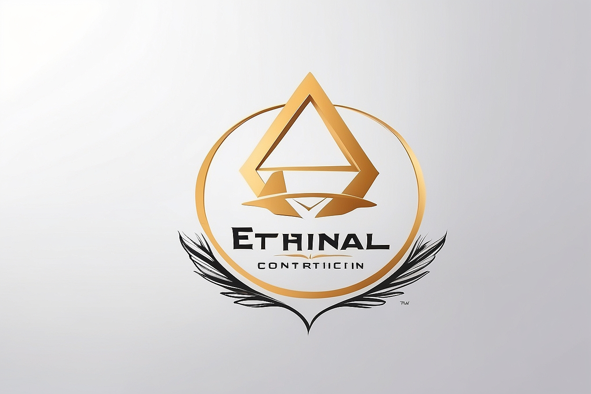

# Natural ou Fake Natty? Como Vencer na Era das IAs Generativas

## 🚀 Introdução

> Woooow! Look at this 👀

Olá pessoal, Venilton da DIO aqui! Inspirado na hype _"Natty or Not"_ do fisiculturismo, este Lab da DIO te convida a conhecer o mundo das IAs Generativas, explorando o potencial dessas tendências tecnológicas incríveis!

## 🎯 Bora Pro Desafio!? Você Já Venceu 💪🤓

### Objetivos

1. **Explorar IAs Generativas**: Utilize essas tecnologias para criar conteúdos que sejam o mais realista possível. Seja criativo! Você pode produzir imagens, textos, áudios, vídeos ou combinações de tudo isso!
1. **Potfólio de Projetos**:
    1. Faça o "fork" deste repositório, criando uma cópia em seu GitHub pessoal;
    2. Edite seu README com os detalhes do seu projeto, siga nosso [Template](#template) (é só copiar, colar e preencher);
    3. Submeta o link do seu repositório na plataforma da DIO. Pronto, você acabou de fortalecer seu portfólio de projetos nos perfis do GitHub e DIO 🚀
1. **Efeito de Rede**: Compartilhe seus resultados nas redes sociais com a hashtag **#LabDIONattyOrNot**. Não esqueça de nos marcar: [DIO](https://www.linkedin.com/school/dio-makethechange) e [falvojr](https://www.linkedin.com/in/falvojr).

### Template

```markdown
ECC - Ethernal construction company

## 📒 Descrição
Nesse projeto foi cosntruido a ideia de gerar uma empresa no ramo de construção utilizando IA generativa

## 🤖 Tecnologias Utilizadas
OpenAi, Maket e Leonardo.Ai . Foram as IAs utilizadas

## 🧐 Processo de Criação
Utiliza-se do OpenAi, para fazer uma descrição da empresa. Além disso, apresenta as ideias gerais de 3 maquetes de um apartamento.
O uso da Maket, foi necessário afim de produzir uma maquete real de um apartamento e por fim o Leonardo.Ai foi preciso para fazer uma logo
da empresa

## 🚀 Resultados
Introdução

Caros clientes, é com grande entusiasmo que venho apresentar a vocês a Ethernal Construction Company (ECC), uma empresa que representa a excelência, inovação e comprometimento no setor da construção civil. Com uma equipe de engenheiros altamente qualificados e uma vasta experiência no mercado, estamos prontos para atender às necessidades mais exigentes em projetos de construção.

Missão:

Na ECC, nossa missão é construir não apenas edifícios, mas sim comunidades sustentáveis, infraestruturas sólidas e ambientes que promovam o bem-estar e o progresso. Nosso compromisso com a qualidade, segurança e respeito ao meio ambiente é inabalável em cada projeto que realizamos.




## 💭 Reflexão (Opcional)
Comente sobre o desafio de criar algo 'natty' com IA.
```

### Exemplos e Insigths

- [E-BOOK](/exemplos/E-BOOK.md)
- [Podcast](/exemplos/PODCAST.md)
- [Vídeo (Avatar Virtual)](/exemplos/VIDEO.md)

## Links Interessantes

[Base10: If You’re Not First, You’re Last: How AI Becomes Mission Critical](https://base10.vc/post/generative-ai-mission-critical/)


